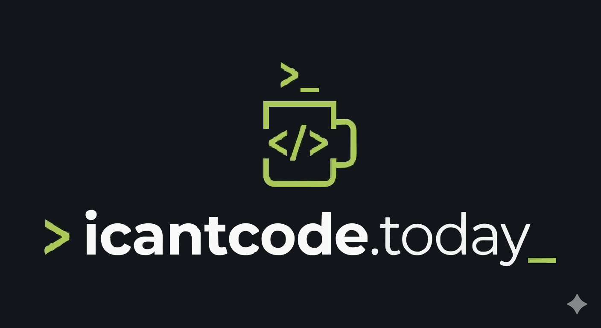

<div align="center">

<br />



# icantcode.today

**`> A shelter for stopped terminals`**

**`> 멈춘 터미널의 쉼터`**

<br />


</div>

<br />

## What is this? / 이게 뭔가요?

A terminal-aesthetic developer community that opens when Claude Code API goes down.
While you can't code, at least you can look like you're coding.

Claude Code API가 멈추면 열리는 터미널 감성 개발자 커뮤니티.
코딩을 못 하는 동안, 코딩하는 척이라도 할 수 있습니다.

```bash
$ curl api.anthropic.com/status

> 200 OK   → "You can code right now. Get back to work!"
             "지금은 코딩할 수 있어요. 일하러 가세요!"

> 503 DOWN → "Claude Code API outage detected."
             "Claude Code API 장애가 감지되었습니다."
```

<br />

## Features / 주요 기능

```
$ icantcode --features

  ▸ CLI Aesthetic UI      Terminal-style interface
  ▸ API Status Monitor    Real-time API health check
  ▸ Anonymous Sessions    No login required
  ▸ Lazy Nickname         Only asked when you post
  ▸ Dark / Light Mode     Theme support
  ▸ i18n (EN/한)          English · 한국어
  ▸ Accessibility         WCAG 2.1 AA
```

<br />

## Tech Stack / 기술 스택

| Category | Technology |
|----------|-----------|
| Framework | React 19 + Vite 6 |
| Language | TypeScript (strict) |
| Server State | TanStack Query v5 |
| Client State | Zustand v5 |
| Styling | Tailwind CSS v4 |
| i18n | react-i18next |
| Animation | motion |
| Font | MulmaruMono (물마루 Mono) |
| Testing | Vitest + React Testing Library + MSW |
| Accessibility | vitest-axe |

<br />

## Project Structure / 프로젝트 구조

```
src/
├── apis/           # API client, queries, queryClient
├── components/
│   ├── ui/         # UI primitives
│   ├── feed/       # Feed components
│   ├── comment/    # Comment components
│   ├── status/     # Status indicators
│   ├── layout/     # Layout wrappers
│   └── common/     # Shared components
├── hooks/          # Custom hooks
├── lib/            # Utilities (i18n, constants, helpers)
├── locales/        # i18n translations (ko/en)
├── pages/          # Page components
├── stores/         # Zustand stores
├── styles/         # Global CSS + terminal.css
├── tests/          # Test utilities
└── types/          # TypeScript type definitions
```

<br />

## Design Philosophy / 디자인 철학

```
"Non-devs should think you're coding."
"비개발자가 보면 코딩하는 것처럼 보여야 한다."

  ▸ Font         MulmaruMono (물마루 Mono)
  ▸ Borders      Box-drawing characters (┌─┐│└─┘)
  ▸ Prompts      >, $, # symbols
  ▸ Cursor       Blink with prefers-reduced-motion
  ▸ Timestamps   Relative ("5m ago", "just now")
```

<br />

## Built with AI Agent Teams / AI 에이전트 팀으로 개발

This project was built entirely with Claude Code, using 9 custom local agents
working in parallel teams.

이 프로젝트는 Claude Code와 9개의 커스텀 로컬 에이전트 팀으로 개발되었습니다.

```
$ ls .claude/agents/

  architect          Architecture decisions & code review
  planner            Requirements analysis & task planning
  designer           CLI aesthetic design system
  developer-feature  Feature implementation
  developer-ui       UI component development
  developer-infra    API client & infrastructure
  accessibility      WCAG 2.1 AA compliance
  qa                 Test strategy & quality assurance
  security           Security review & vulnerability check
```

<br />